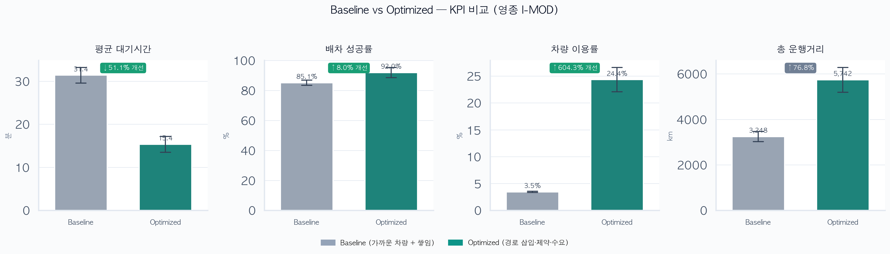

# DRT-OPT — 영종도 I-MOD 수요응답형 버스 동적 배차 최적화

> 제 8회 인천광역시 공공데이터 활용 창업 분석 경진대회 (장려상 수상)
> 영종도 I-MOD 지역의 신규 호출에 대해 **기존 승객 불편 · 대기 · 정원 · 정류장 수요**를 동시에 고려하는 배차 알고리즘과 시뮬레이터

---

## 📂 프로젝트 개요

인천 영종도 I-MOD(수요응답형 버스) 운영을 가정해, 실시간 호출이 들어왔을 때 **어떤 차량에 어떤 순서로 배차할 지**를 결정

| 구분 | 설명 |
|---|---|
| **Baseline** | 가장 가까운 차량에 요청을 순서대로 쌓는 기존 방식 |
| **Optimized** | 경로 삽입 · 제약 검사 · 수요 가중 점수로 최적 차량·순서 선택 |
| **Simulator** | 이산사건 시뮬레이터로 KPI(대기시간, 성공률, 운행거리 등) 비교 |

---

## 📝 주요 기능

- **동적 배차 최적화** — insertion + 제약 + scoring + demand weight
- **Baseline vs Optimized 비교** — 동일 seed·동일 수요로 KPI·지도 비교
- **웹 시뮬레이터** — Leaflet 듀얼 맵, 타임라인 재생/일시정지
- **GPU 가속** — PyTorch batched filtering (CUDA / Apple MPS / CPU fallback)
- **실제 지도 연동** — OpenStreetMap + Folium, OSRM 도로 경로
- **영종도 전용 필터** — bbox·키워드 기반 정류장 추출
- **가중치 자동 탐색** — 시뮬레이터 기반 random/grid search

---

## 💻 사용 기술

| 영역 | 기술 |
|---|---|
| Language | Python 3.11+ |
| Simulation | NumPy, NetworkX, 이산사건 엔진 |
| Optimization | 경로 삽입, 제약·점수 함수 |
| GPU | PyTorch |
| Map / Viz | Folium, OSRM, Matplotlib, Seaborn |
| Web | FastAPI, Uvicorn, Leaflet |
| Data | OpenStreetMap Overpass, 인천 BIS Open API, data.go.kr CSV |
| Config | YAML |

---

## 💻 실행 화면

### Baseline vs Optimized KPI 비교



> `python scripts/run_experiment.py --runs 30 --gpu --output results/` 실행 결과

### 🗺️ 지도 출력 예시

| 네트워크 지도 | 시뮬레이션 경로 |
|---|---|
| `results/maps/yeongjong_network.html` | `results/maps/sim_optimized_seed42.html` |

브라우저에서 HTML 파일을 열면 OpenStreetMap 위 정류장·차량·경로를 확인할 수 있습니다.

### 🌐 웹 시뮬레이터 (Baseline vs Optimized)

```bash
python -m drt_opt.cli web
# → http://127.0.0.1:8080
```


| | |
|---|---|
| **왼쪽** | Baseline — 가까운 차량 + 요청 쌓임 |
| **오른쪽** | Optimized — 경로 삽입 · 제약 · 수요 가중 |
| **재생** | 타임라인 슬라이더 / 4x 속도 / seed 변경 |

---

## Requirements

- **Python 3.11 이상**
- **Git**
- (선택) NVIDIA GPU 또는 Apple Silicon — GPU 가속 사용 시
- (선택) [공공데이터포털](https://www.data.go.kr) API 키 — 인천 BIS 정류장·승객 데이터 병합 시

---

## 실행 방법

### 1. 가상환경

```bash
git clone https://github.com/<your-id>/DRT-OPT-Demand-Responsive-Transit-Optimization.git
cd DRT-OPT-Demand-Responsive-Transit-Optimization

python -m venv .venv
source .venv/bin/activate          # Windows: .venv\Scripts\activate
pip install -e ".[dev]"
```

설치 확인:

```bash
python -m drt_opt.cli --help
```

### 2. 데이터 세팅

영종도 버스정류장 원본 CSV를 `data/raw/`에 다운로드

**방법 A — 자동 다운로드 (권장, API 키 불필요)**

OpenStreetMap Overpass에서 영종 bbox 내 정류장을 받습니다. 네트워크 필요, **1~2분** 소요될 수 있습니다.

```bash
python -m drt_opt.cli download-data
```

생성 파일:

| 파일 | 설명 |
|---|---|
| `data/raw/stops.csv` | 정류장 ID·이름·좌표 (~400곳) |
| `data/raw/demand.csv` | 수요 가중치 (승객 CSV 없을 때 균등 분배) |
| `data/raw/download_meta.json` | 다운로드 출처 메타정보 |

**방법 B — 인천 BIS API 병합**

```bash
cp .env.example .env
# .env → DATA_GO_KR_KEY=발급받은키
python -m drt_opt.cli download-data
```

**방법 C — 공공데이터 CSV 수동 배치**

| 파일 | 출처 |
|---|---|
| `data/raw/stops.csv` | [버스노선별 정류장 현황](https://www.data.go.kr/data/15048265/fileData.do) |
| `data/raw/demand.csv` | [정류장별 이용승객 현황](https://www.data.go.kr/data/15048264/fileData.do) |
| `data/raw/links.csv` | [버스정보관리시스템 논리링크 현황](https://www.data.go.kr/data/15117311/fileData.do) |


### 3. 데이터 전처리

`data/raw/` CSV → travel matrix·정류장 JSON 등 `data/processed/` 생성.

```bash
python -m drt_opt.cli preprocess
```

| 출력 | 설명 |
|---|---|
| `data/processed/stops.json` | 필터링된 정류장 목록 |
| `data/processed/travel_time.npy` | 정류장 간 이동 시간 행렬 |
| `data/processed/travel_distance.npy` | 정류장 간 거리 행렬 |
| `data/processed/region.json` | 영종 bbox·정류장 수·데이터 출처 |

전처리 결과 지도 확인 (선택):

```bash
python -m drt_opt.cli map
# → results/maps/yeongjong_network.html (브라우저에서 열기)
```

### 4. 가중치 자동 탐색

시뮬레이터로 배차 점수 가중치(`wait`, `detour`, `distance`, `demand`)를 탐색.  

```bash
# Random search (기본: 40 trials × 5 seeds, 수 분~수십 분 소요)
python -m drt_opt.cli tune-weights

# 빠른 테스트
python -m drt_opt.cli tune-weights --trials 10 --seeds 0 1

# Grid search
python -m drt_opt.cli tune-weights --method grid

# 탐색 결과를 config/default.yaml에 반영 (5·6단계에 적용됨)
python -m drt_opt.cli tune-weights --apply
```

결과 파일:

| 파일 | 설명 |
|---|---|
| `results/tuning/trials.csv` | trial별 가중치·KPI |
| `results/tuning/best_weights.yaml` | 최적 가중치 |
| `results/tuning/summary.json` | 탐색 요약 |

목적함수 (낮을수록 좋음):

```
objective = w_wait×평균대기 + w_success×(1-성공률) + w_distance×운행거리 + w_reject×거절률
```

범위·trial 수는 `config/default.yaml` → `tuning` 섹션에서 조정.

### 5. 시뮬레이션 1회 실행

전처리된 네트워크 + (4단계 `--apply` 시) 최적 가중치로 KPI를 출력.

```bash
# 최적화 배차 (기본)
python -m drt_opt.cli simulate --dispatcher optimized --seed 42

# 기존 방식과 비교
python -m drt_opt.cli simulate --dispatcher baseline --seed 42

# 지도 HTML까지 저장
python -m drt_opt.cli simulate --dispatcher optimized --map --seed 42
# → results/maps/sim_optimized_seed42.html

# GPU 사용 (Apple Silicon MPS / NVIDIA CUDA)
python -m drt_opt.cli simulate --dispatcher optimized --gpu --seed 42
```

터미널에 KPI JSON(대기시간, 성공률, 운행거리 등)이 출력.

배차 점수 (Optimized):

```
cost = w_wait×wait + w_detour×detour + w_distance×added_dist − w_demand×demand_bonus
```

### 6. 웹 시뮬레이터 실행

Baseline vs Optimized를 **좌우 지도**에서 동시에 비교.

```bash
python -m drt_opt.cli web
```

브라우저에서 **http://127.0.0.1:8080** 접속.

| 패널 | 알고리즘 |
|---|---|
| 왼쪽 | Baseline — 가까운 차량 + 요청 쌓임 |
| 오른쪽 | Optimized — 경로 삽입 · 제약 · 수요 가중 |

- OpenStreetMap 위 차량·경로·호출 애니메이션
- 타임라인 슬라이더 / 재생·일시정지 / seed 변경

---

## 프로젝트 구조

```
DRT-OPT-Demand-Responsive-Transit-Optimization/
├── config/default.yaml      # 시뮬레이션·가중치·영종 bbox 설정
├── data/
│   ├── raw/                 # stops.csv, demand.csv (원본)
│   └── processed/           # stops.json, travel matrix (전처리 결과)
├── scripts/
│   ├── download_data.py     # 데이터 다운로드
│   └── run_experiment.py    # Baseline vs Optimized 실험
├── results/                 # KPI, 지도, tuning 결과
└── src/drt_opt/
    ├── data/                # 로더, OSM/API 다운로드
    ├── dispatch/            # baseline / optimized / gpu_optimized
    ├── simulation/          # 이산사건 시뮬레이터
    ├── metrics/             # KPI 수집
    ├── tuning/              # 가중치 탐색
    ├── viz/                 # Folium + OSRM 지도
    └── web/                 # FastAPI + Leaflet UI
```

---

## 참고 자료

- [인천 BIS Open API — 주변정류소 목록조회](https://bus.incheon.go.kr/bis/openApiGuide22.view)
- [공공데이터포털 — 인천 버스노선별 정류장 현황](https://www.data.go.kr/data/15048265/fileData.do)
- [공공데이터포털 — 인천 정류장별 이용승객 현황](https://www.data.go.kr/data/15048264/fileData.do)
- OpenStreetMap Overpass API
